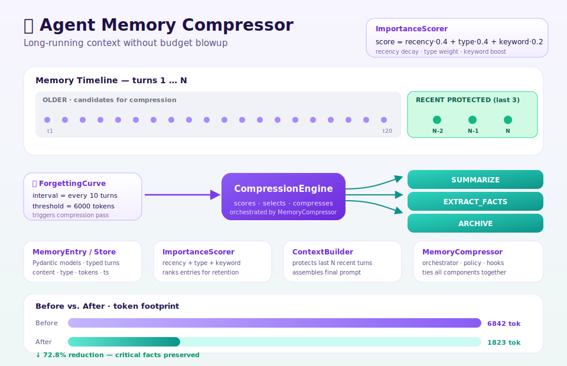

# Agent Memory Compressor

> 🤖 **Autonomously built using [NEO](https://heyneo.com) — Your Autonomous AI Engineering Agent**
>
> [](https://marketplace.visualstudio.com/items?itemName=NeoResearchInc.heyneo) [](https://marketplace.cursorapi.com/items/?itemName=NeoResearchInc.heyneo)

<p align="center">
  
</p>

[](https://www.python.org/downloads/)
[](https://opensource.org/licenses/MIT)

Intelligent memory compression for long-running LLM agents. Prevents context window exhaustion while preserving critical facts and decisions.

## The Problem: Context Window Exhaustion

Long-running LLM agents face a fundamental challenge: **finite context windows**. As conversations grow:

- Token counts exceed model limits (4K-128K tokens)
- Older messages get truncated or dropped
- Critical decisions and facts are lost
- Agent performance degrades over time
- Costs increase with repeated API calls

Traditional solutions like simple truncation lose valuable context. **Agent Memory Compressor** solves this through intelligent, score-based compression.

## The Solution: Score-Based Compression

This library implements a multi-factor importance scoring system that identifies which memories to preserve and which to compress:

### Importance Scoring Formula

```
Final Score = (Recency × 0.4) + (Type Weight × 0.4) + (Keyword Boost × 0.2)
```

**Recency (40%)**: Exponential decay scoring
- Last 5 turns: 1.0 (full importance)
- Older entries: decay by 0.15 per turn

**Type Weight (40%)**: Entry type prioritization
| Entry Type | Weight |
|------------|--------|
| Decision | 0.9 |
| Fact | 0.9 |
| Agent Turn | 0.6 |
| User Turn | 0.5 |
| Tool Result | 0.4 |

**Keyword Boost (20%)**: Goal-related keywords add +0.2

### Compression Strategies

Three strategies handle different compression needs:

1. **Summarize**: Groups entries into a 3-sentence summary preserving decisions
2. **Extract Facts**: Extracts bullet-list facts as discrete FACT entries
3. **Archive**: Minimal retention for truly low-value entries

## The Forgetting Curve

Inspired by Ebbinghaus's forgetting curve, compression triggers on:

- **Turn-based**: Compress every N turns (default: 10)
- **Token-based**: Compress when exceeding token threshold (default: 6000)

The `ForgettingCurve` class schedules compression rounds, ensuring memory stays within budget while adapting to conversation velocity.

## Quick Start

### Installation

```bash
pip install -e .
```

### Basic Usage

Import `MemoryStore`, `MemoryCompressor`, and `CompressionEngine`, populate a store with `MemoryEntry` objects, then call `compressor.compress(store)` when `should_compress` returns true.

## Architecture

- **models.py**: MemoryEntry and MemoryStore
- **scoring.py**: ImportanceScorer with recency, type, keyword signals
- **strategies.py**: CompressionEngine with summarize/extract/archive
- **orchestrator.py**: MemoryCompressor - main compression loop
- **triggers.py**: ForgettingCurve - schedule-based triggers
- **context.py**: ContextBuilder - assemble LLM prompt context
- **adapters.py**: Integration with agent-session-manager

## Testing

```bash
pytest tests/ -v
```

## ✨ New Features

### Persistence

`MemoryPersistence` serializes any `MemoryStore` to JSON and restores every
`MemoryEntry` field (including `turn_number`, `importance_score`,
`compression_history`, and the `"compressed"` role markers). Use `MemoryPersistence().save`/`load` for low-level access, or `MemoryCompressor.save`/`load` to also persist the latest `CompressionReport`.

Both `str` and `pathlib.Path` are accepted, parent directories are created
on demand, existing files are overwritten, and missing files raise
`FileNotFoundError`.

### Compression analytics CLI

Installing the package registers a `memory-cli` entry point powered by
Click and Rich.

```bash
# Rich-table inspection of a persisted store
memory-cli inspect session.json

# Compress to a token budget and write an output file; a before/after bar
# is printed as JSON on stdout.
memory-cli compress session.json --budget 500 --output session.compressed.json
# => {"before": 2345, "after": 489, "saved": 1856, "reduction_pct": 79.15}

# Run the bundled 50-turn long-run demo programmatically
memory-cli demo
```

## License

MIT License - see LICENSE file.
